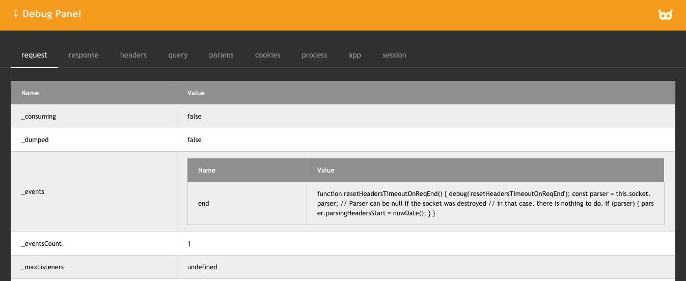
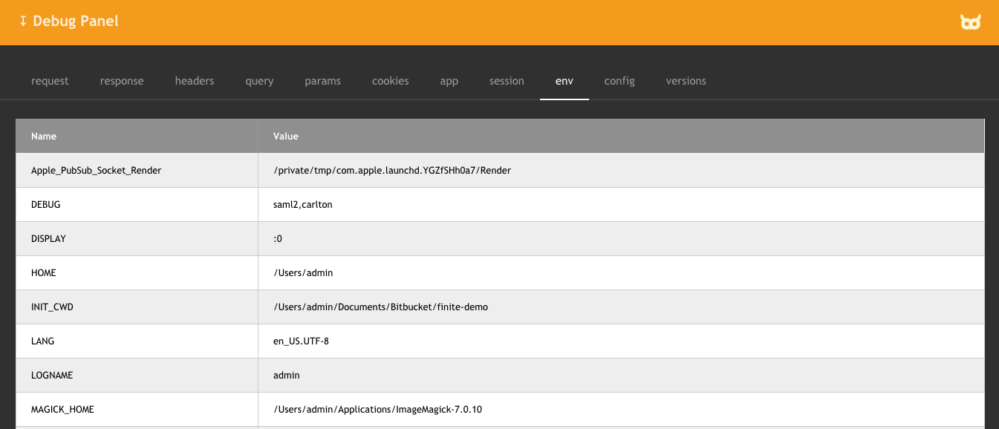

# express-debug-panel

A panel containing useful debugging information, for use in Express.js applications.

## Examples

The **Debug Panel** is initially displayed in collapsed form:

When you click on it, it opens in its default format:

In this default format, it shows information for the following **Express.js** and **Node.js** objects:

- [request](http://expressjs.com/en/api.html#req)
- [response](http://expressjs.com/en/api.html#res)
- [headers](https://nodejs.org/api/http.html#http_message_headers)
- [query](http://expressjs.com/en/api.html#req.query)
- [params](http://expressjs.com/en/api.html#req.params)
- [cookies](https://expressjs.com/en/resources/middleware/cookie-parser.html)
- [process](https://nodejs.org/api/process.html)
- [app](http://expressjs.com/en/api.html#app)
- [session](https://www.npmjs.com/package/express-session)

You can also provide a custom format for the **Debug Panel**. In the following screenshot, we have
suppressed the *process* object and replaced it with *env*, *config*, and *versions* objects.

## Demonstration

See a live demonstration of the **Debug Panel** at [demo.finitewisdom.com](https://demo.finitewisdom.com/express-debug-panel).

## Installation

    $ npm install express-debug-panel

## Use

The **Debug Panel** works with all Express.js [template engines](http://expressjs.com/en/guide/using-template-engines.html#using-template-engines-with-express).
Here are the instructions for the three most popular engines:

- [EJS](https://ejs.co/)
- [Pug](https://pugjs.org/api/getting-started.html)
- [Mustache](https://github.com/janl/mustache.js)

### Use with EJS

To add a **Debug Panel** to the `/test` route of your Express.js application that utilizes **EJS** templates, use the following code:

    const
        debugPanel = require( "express-debug-panel" ),
        debugPanelOptions = null;

    function get( req, res ) {
        res.render( "test.ejs", { 
            "req": req,
            "debugPanel": debugPanel,
            "debugPanelOptions": debugPanelOptions
        } );
    }

    function addRoutes( router ) {
        router.get( "/test", get );
    }

    exports.addRoutes = addRoutes;

In your `test.ejs` view, include the following code:

    <%
        if ( process.env.NODE_ENV.toLowerCase() !== "production" ) {
            debugPanel.render( req, debugPanelOptions, ( err, html ) => { %>
                <%- err ? JSON.stringify( err ) : html %> <%
            } );
        } 
    %>

### Use with Pug

To add a **Debug Panel** to the `/test` route of your Express.js application that utilizes **Pug** templates, use the following code:

    const
        debugPanel = require( "express-debug-panel" ),
        debugPanelOptions = null;

    function get( req, res ) {
        res.render( "test.pug", { 
            "req": req,
            "debugPanel": debugPanel,
            "debugPanelOptions": debugPanelOptions
        } );
    }

    function addRoutes( router ) {
        router.get( "/test", get );
    }

    exports.addRoutes = addRoutes;

In your `test.pug` view, include the following code:

    -   if ( process.env.NODE_ENV.toLowerCase() !== "production" )
    -       debugPanel.render( req, debugPanelOptions, ( err, html ) => {
                != err ? JSON.stringify( err ) : html 
    -       } );

### Use with Mustache

To add a **Debug Panel** to the `/test` route of your Express.js application that utilizes **Mustache** templates, use the following code:

    const
        debugPanel = require( "express-debug-panel" ),
        debugPanelOptions = null;

    function get( req, res ) {
        if ( process.env.NODE_ENV.toLowerCase() !== "production" ) {
            debugPanel.render( req, debugPanelOptions, ( err, html ) => {
                res.render( "test.mst", { 
                    "req": req,
                    "debugPanelOutput": ( err || html )
                } );            
            } );
        } else {
            res.render( "test.mst", { 
                "req": req,
                "debugPanelOutput": null
            } );
        }
    }

    function addRoutes( router ) {
        router.get( "/test", get );
    }

    exports.addRoutes = addRoutes;

In your `test.mst` view, include the following code:

    {{{ debugPanelOutput }}}

## Configuration

You can configure what is displayed in the **Debug Panel** by passing an `options` object as the 2nd argument to `debugPanel.render`. The `options` object takes the following form:

    {
        "name": {
            "object": obj,
            "maxDepth": 2,
            "display": true
        },
        ...
    }

where:

- **name** is the name of the tab within the **Debug Panel**
- **obj** is the object to display
- **maxDepth** is the maximum depth that will be displayed for nested objects
- **display** indicates whether to include this tab within the **Debug Panel**

The default configuration for the **Debug Panel** is:

    {
        "request": {
            "object": req,
            "maxDepth": 2,
            "display": true
        },
        "response": {
            "object": req.res,
            "maxDepth": 2,
            "display": true
        },
        "headers": {
            "object": req.headers,
            "maxDepth": 1,
            "display": true
        },
        "query": {
            "object": req.query,
            "maxDepth": 1,
            "display": true
        },
        "params": {
            "object": req.params,
            "maxDepth": 1,
            "display": true
        },
        "cookies": {
            "object": req.cookies,
            "maxDepth": 1,
            "display": true
        },
        "process": {
            "object": process,
            "maxDepth": 3,
            "display": true
        },
        "app": {
            "object": req.app,
            "maxDepth": 4,
            "display": true
        },
        "session": {
            "object": req.session,
            "maxDepth": 3,
            "display": true
        }
    }

As an example, let's say that we wanted to configure the **Debug Panel** to suppress the *process* tab and replace it with three others:

- *env*
- *config*
- *versions*

To do so, we would define an `options` object of the form:

    {
        "process": {
            "display": false
        },
        "env": {
            "object": process.env,
            "maxDepth": 1,
            "display": true
        },
        "config": {
            "object": process.config,
            "maxDepth": 3,
            "display": true
        },
        "versions": {
            "object": process.versions,
            "maxDepth": 1,
            "display": true
        }
    }

We would then replace this code:

    const
        debugPanel = require( "express-debug-panel" ),
        debugPanelOptions = null;

with this code:

    const
        debugPanel = require( "express-debug-panel" ),
        debugPanelOptions = {
            "process": {
                "display": false
            },
            "env": {
                "object": process.env,
                "maxDepth": 1,
                "display": true
            },
            "config": {
                "object": process.config,
                "maxDepth": 3,
                "display": true
            },
            "versions": {
                "object": process.versions,
                "maxDepth": 1,
                "display": true
            }
        };

## License

(The MIT License)

Copyright (c) 2020 Finite Wisdom <j@wiz4.us>

Permission is hereby granted, free of charge, to any person obtaining a copy of this software and associated documentation files (the 'Software'), to deal in the Software without restriction, including without limitation the rights to use, copy, modify, merge, publish, distribute, sublicense, and/or sell copies of the Software, and to permit persons to whom the Software is furnished to do so, subject to the following conditions:

The above copyright notice and this permission notice shall be included in all copies or substantial portions of the Software.

THE SOFTWARE IS PROVIDED 'AS IS', WITHOUT WARRANTY OF ANY KIND, EXPRESS OR IMPLIED, INCLUDING BUT NOT LIMITED TO THE WARRANTIES OF MERCHANTABILITY, FITNESS FOR A PARTICULAR PURPOSE AND NONINFRINGEMENT. IN NO EVENT SHALL THE AUTHORS OR COPYRIGHT HOLDERS BE LIABLE FOR ANY CLAIM, DAMAGES OR OTHER LIABILITY, WHETHER IN AN ACTION OF CONTRACT, TORT OR OTHERWISE, ARISING FROM, OUT OF OR IN CONNECTION WITH THE SOFTWARE OR THE USE OR OTHER DEALINGS IN THE SOFTWARE.